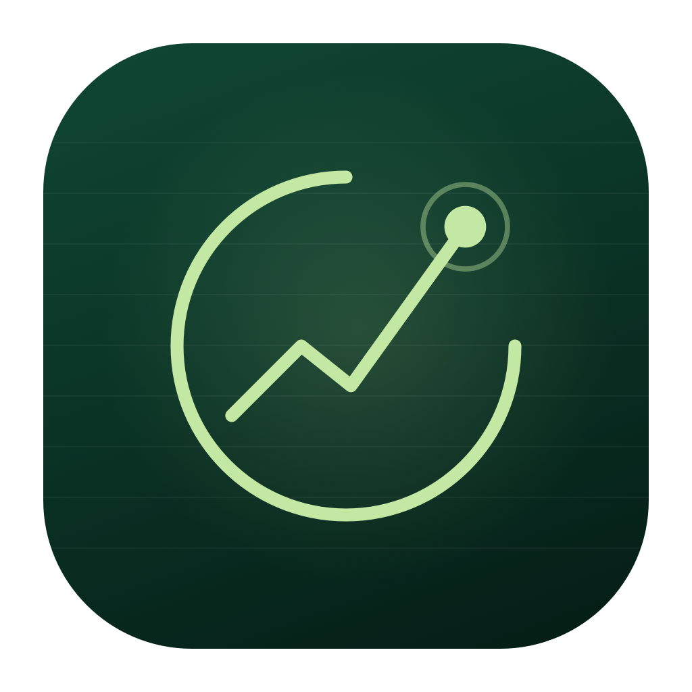
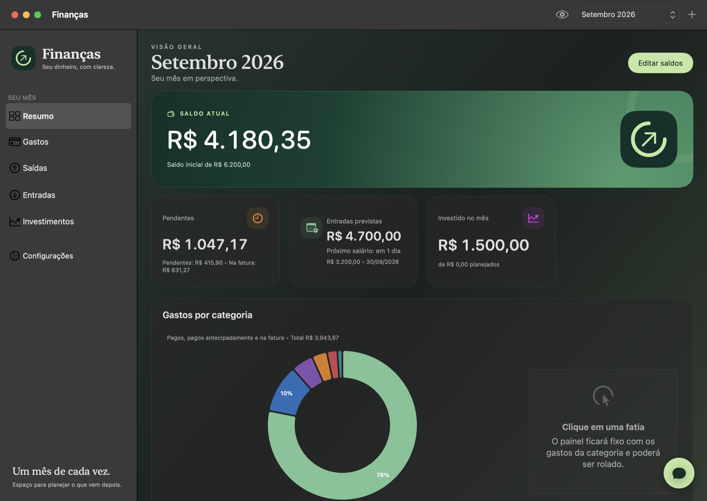
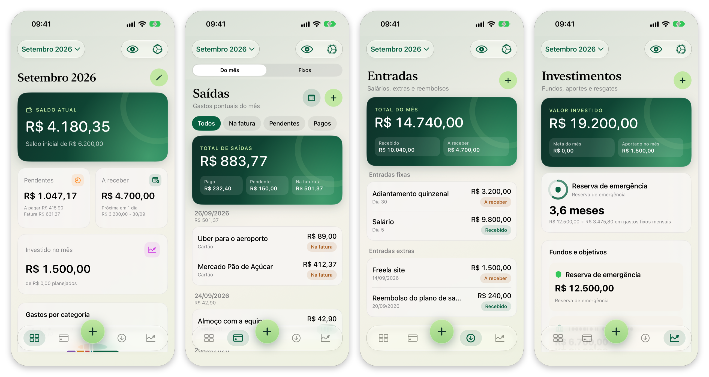

<div align="center">
  
  <h1>Finanças</h1>
  <p><strong>Your money, with clarity.</strong></p>
  <p>A native app to organize your month, track expenses, and plan what comes next.<br>No account, no server. Your data stays on your Mac and iPhone.</p>
  <p>
    
    
    
    
  </p>
  <p><a href="#your-month-in-one-place">Features</a> · <a href="#local-ai-assistant">Local AI</a> · <a href="#start-here">How to run</a> · <a href="#build-the-app">Build</a> · <a href="#iphone">iPhone</a> · <a href="#your-data">Data and backup</a></p>
</div>

<p align="center">
  
</p>

<p align="center">
  
</p>

---

## Your month in one place

| Area | What you track |
| --- | --- |
| **Summary** | Current balance, pending payments, card bill, expected salary, and spending by category. |
| **Expenses** | Recurring expenses, organized by category and copied into new months. |
| **Outflows** | One-off purchases and payments, with status filters. |
| **Income** | Salaries, extra income, and the next expected fixed income. |
| **Investments** | Funds, goals, contributions, withdrawals, and emergency reserve coverage. |
| **Settings** | Recurrences, local files, backup import or export, and local Ollama configuration. |

### Local AI assistant

Open the speech bubble in the lower-right corner of any main screen and choose **Registrar saída**. Describe one or more completed expenses in Portuguese, for example: `Gastei 42,90 no almoço no pix e 89 de Uber no cartão ontem.` Messages stay visible throughout the conversation. The assistant asks follow-up questions for missing amounts, payment methods or dates, then presents a summary for confirmation. Choose **Corrigir** to send a revised list or **Confirmar e salvar** to save. A success message appears in the chat, with the option to register another expense. The assistant follows a guided workflow rather than an unrestricted chat.

Configure your Ollama URL and model in **Settings**. Requests require structured JSON output and use `think: false`. The app parses amounts, supported dates, and payment aliases before inference, calculates totals locally, and preserves its existing balance rules. See [AI architecture and supported input](docs/ai-architecture.md).

### Always close at hand

Click the Finanças symbol in the menu bar to check your balance, pending payments, card bill, and next fixed income. You can also record an outflow or income there.

Choose **Chat** in the panel footer to replace the quick overview with the assistant in the same window. Use **Voltar à visão rápida** in the chat header to return to the overview.

**Open Finanças** takes you to the full window. Closing the window keeps the menu bar panel available; to quit the app, choose **Quit Finanças** from the panel menu.

### An interface with room to breathe

Deep green, sandy tones, and a symbol of growth give the app its identity. On macOS 26 or later, buttons use native Liquid Glass; cards feature translucent materials. Earlier versions use compatible controls.

The app respects the macOS **Reduce transparency** preference. The eye button, available in the window and the menu bar panel, lets you hide amounts.

## Start here

To run the app, you need **macOS 14 or later**. To compile the current code, use **Xcode 26 or later**, with the macOS 26 SDK and command line tools selected.

From the project root:

```bash
swift run Financas
```

You can also open `Package.swift` in Xcode, select the **Financas** scheme, and press **⌘R**.

## Build the app

The script compiles the production version, includes the icon, and creates a locally signed app:

```bash
./scripts/build-app.sh
```

The result is at **`dist/Financas.app`**. To open it:

```bash
open dist/Financas.app
```

To build only the executable:

```bash
swift build -c release
```

It will be at `.build/release/Financas`. Distribution to other Macs requires proper signing and notarization; the script uses an *ad hoc* signature for local use.

## iPhone

The same sources also build an iOS app from `iOS/Financas.xcodeproj`. It shares every screen with the Mac, arranged for a phone: four tabs (Summary, Expenses, Income, Investments) around a raised **+** button that records an outflow, an income, a fixed expense or an investment movement, or opens the assistant. Expenses switches between the month's outflows and fixed expenses. The month, the eye button and Settings are in the navigation bar, and forms open as half-height bottom sheets.

A medium home screen widget offers three shortcuts: **Resumo** opens the summary, and **Saída** and **Entrada** open the app straight into the matching form. It shows no amounts, so nothing about your money is visible on the home screen. The menu bar panel exists only on the Mac.

### Install from Xcode

1. Open `iOS/Financas.xcodeproj`.
2. In **Signing & Capabilities**, choose your team (a free Apple ID works). If the bundle identifier is taken, change it once and keep it: a new identifier means a new, empty app.
3. Connect the iPhone, enable **Developer Mode** on it, and press **⌘R**.

With a free account the signature expires after 7 days: the app stops opening, but its data stays on the phone. Running it again from Xcode updates it in place and keeps the data. **Deleting the app deletes its database.**

### Install with SideStore or AltStore

To avoid rebuilding every week, build an unsigned package and let SideStore or AltStore sign and refresh it on the phone:

```bash
./scripts/build-ipa.sh
```

The result is at **`dist/Financas.ipa`**. These tools register their own copy of the app, so move your data with a backup: export it from the old copy, then import it into the new one.

### Moving data between devices

The Mac and the iPhone keep separate databases; nothing is synced. To copy one to the other, use **Settings → Backup**: export on one device, send the file with AirDrop or iCloud Drive, and import it on the other. Importing replaces all data on that device.

The local AI assistant on the iPhone needs an Ollama server that the phone can reach on the local network. Set its address in Settings.

## How balances work

The current balance starts from the amount you enter and tracks completed transactions:

- Received income and withdrawals increase the account balance.
- Paid expenses and investment contributions decrease the balance.
- Pending entries or those still on the card bill do not affect the balance until paid.
- Paying off the card bill moves items from **On the bill** to **Paid**, without creating another expense.

Recurring expenses show their configured charge day in the fixed expenses screen. Card expenses remain **Pending** until you manually change them to **On the bill**; the app no longer moves them automatically when the charge day arrives. PIX, debit, and automatic debit also remain pending until payment is confirmed.

The emergency reserve is displayed in months of coverage, using the balance of the fund marked as the reserve and the selected month's fixed expenses.

## Your data

On the Mac, the SQLite database is at this path:

```text
~/Library/Application Support/Financas/financas.sqlite
```

On the iPhone, it lives inside the app's own storage. In **Settings**, you can export a backup, import a copy, or, on the Mac, reveal the file in Finder. **Importing replaces the current data.** The database and `.sqlite` backups are ignored by Git.

This is a personal project: the first launch creates the structure, default data, and funds with the opening balances defined in [`Database.swift`](Sources/Financas/Database.swift). It does not create months or cash transactions. Review these values before using the project for your own finances.

## Development

Interface in **SwiftUI**, charts with **Swift Charts**, macOS integration through **AppKit**, local persistence in **SQLite**, and structured local AI integration through Ollama.

```bash
swift test
```

To run the app against another database, for demos or screenshots, set `FINANCAS_DATABASE` to the path of a `.sqlite` file. Your real data is left untouched.

The icon is drawn in code. To regenerate the PNG and ICNS files used by the app:

```bash
swift scripts/generate-icon.swift
```

<div align="center">
  <br>
  <p><em>One month at a time.</em></p>
</div>
